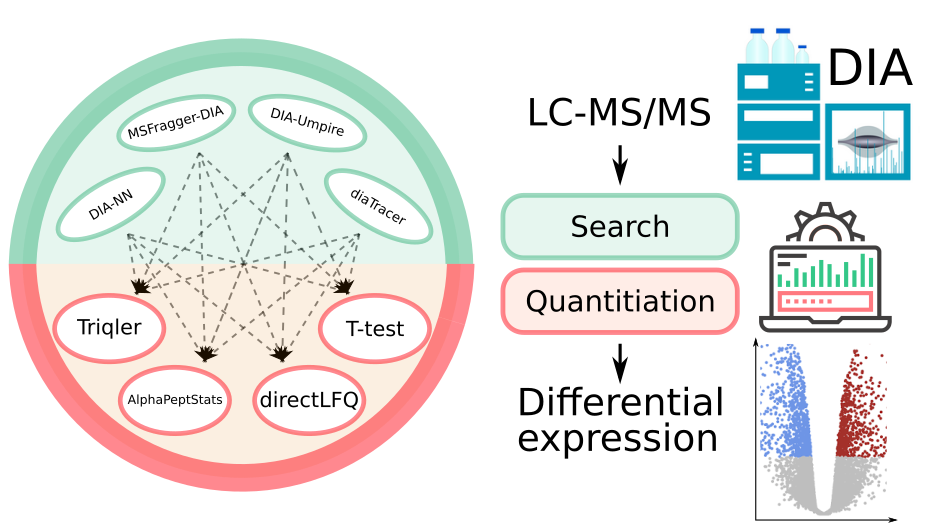

# Comparison study of data processing workflows for label-free DIA quantitative proteomics
## Intro

This repository contains all the code, metadata (database and parameters files), and search results to reproduce the proteomic software for data independent aquisition data analysis comparison described in the manuscript [link]. 

In brief, two major platforms for DIA protein search - DIA-NN and FragPipe (with DIA-Umpire, MSFragger-DIA, and diaTracer based workflows) - were used in pairs with programms for quantitative analysis (directLFQ, AlphaPeptStats, Triqler) to better understand technical compatibilities, araising possibilities and limitations provided in each workflow.

## Setup and Usage

This project contains five folders:
  - `fasta` - contains all protein sequence databases.
  - `figures` - all the figures generated throught the research.
  - `input_files` - contains directory structure with filelists.txt files containing lists of the expected files (.mzML or .d format) to be placed in said folder for proper relative paths work. All the files are publicly available in the ProteomeXchange repository with the identifiers of PXD028735 for LFQbench dataset and PXD026600 for UPS-E.coli dataset. ThermoRawFileParser were used to convert .raw files to .mzML format. Bruker .d format was only unzipped and not converted further.
  - `quantitation` - contains all quantitation tables of differentially expressed proteins with fold change, p-values, etc. Are used in `figures.ipynb`.
  - `search_results` - contains parameters files, log files, and `report.pg_matrix.tsv` for each search. For example, `fragpipe-files.fp-manifest` and `fragpipe.workflow` files sufficient for reproducing the search of the Orbitrap part of the LFQ benchmark dataset using FragPipe with MSFragger-DIA workflow, and `report.pg_matrix.tsv` result of that search are located in `search_results/fragpipe24_LFQbench_msfragger`.

All the code is divided through four jupyter notebooks: 
  - `searches.ipynb` - reproduces search results inside `search_results` folder.
  - `quantitation_alpha_direct_manual.ipynb` - reproduces quantitation results with AlphaPeptStats, directLFQ, and Manual workflows inside `quantitation` folder. Use primarily `report.pg_matrix.tsv` files from the search_results.
  - `quantitation_triqler.ipynb` - reproduces quantitation results with Triqler inside `quantitation` folder. Use `report.tsv` or `report.parquet` files from the `search_results`, and thus would not work without prior reproducing search results.
  - `figures.ipynb` - generates all figures used in the study in the `figures` folder.

Generally, all the notebooks are operating inside the project folder and relative paths are set. `figures.ipynb` works straight out of the box (with installation of neccessary packages), since all needed tables with quantitation results are provided. Some paths to the tools/virtual environments/input files may need correction inside `searches.ipynb`, `quantitation_alpha_direct_manual.ipynb`, and `quantitation_triqler.ipynb` to match user's installation setup.

### Setup

All the tools that are not Python packages are called from an external `tools` folder.

Here is a list of versions and sources for the used software:
  - `ThermoRawFileParser` version 1.4.5 [link](https://github.com/compomics/ThermoRawFileParser)
  - `DIA-NN` version 2.3.1 [link](https://github.com/vdemichev/diann)
  - `FragPipe` version 24.0 [link](https://github.com/Nesvilab/FragPipe/releases) [guide](https://fragpipe.nesvilab.org/docs/tutorial_fragpipe.html) to setup.
  - `MSFragger` version 4.4.0 [link](https://github.com/Nesvilab/MSFragger)
  - `diaTracer` version 2.3.2 [link](https://github.com/Nesvilab/diaTracer)
  - `DIA-Umpire` version 2.2.1 [link](https://github.com/Nesvilab/DIA-Umpire)
  - `IonQuant` version 1.11.18 [link](https://github.com/Nesvilab/IonQuant)
  - `AlphaPeptStats` version 0.7.2 [link](https://github.com/MannLabs/alphapeptstats)
  - `directLFQ` version 0.3.3 [link](https://github.com/MannLabs/directlfq)
  - `Triqler` version 0.9.1 [link](https://github.com/statisticalbiotechnology/triqler)

All the notebooks operates on single Python version of 3.10.11. Two different environments (kernels) are used, since different packages needs different versions of the core libraries like numpy. Although it is possible to install all neccessary packages inside notebooks by `pip`, authors strongly recommend to use virtual environments like `pyenv`. Here are simple steps to setup working environments:

Download Python 3.10.11 as possible version for pyenv:

    pyenv install 3.10.11

Create and activate virtual environment for AlphaPeptStats with python version 3.10.11 (for detailed guide for `pyenv` see [link](https://akrabat.com/creating-virtual-environments-with-pyenv/)) :

    pyenv virtualenv 3.10.11 3.10.11_alphastats
    pyenv activate 3.10.11_alphastats

Install all neccessary packages:

    pip install alphastats
    pip install directlfq

Install `ipykernel` and create kernel for jupyter notebook from this environment:

    pip install ipykernel
    python -m ipykernel install --user --name alphastats_3.10.11
    pyenv deactivate

Then set new `alphastats_3.10.11` as a kernel to operate in three notebooks `searches.ipynb`, `quantitation_alpha_direct_manual.ipynb`, `figures.ipynb` and repeat to create triqler kernel:

    pyenv virtualenv 3.10.11 triqler31011
    pyenv activate triqler31011
    pip install pyteomics
    pip install matplotlib
    pip install ipykernel
    python -m ipykernel install --user --name triqler_3.10.11
    pyenv deactivate

Then set new `triqler_3.10.11` as a kernel to operate in `quantitation_triqler.ipynb`.

## Troubleshooting

In case of any issues check :
  - [Issues](https://github.com/PostoenkoVI/DIA_tools_benchmark/issues)

Or contact us directly!

## Contact information 
  - v.i.postoenko@gmail.com - Postoenko Valerii 
  - markmipt@gmail.com - Ivanov Mark 
